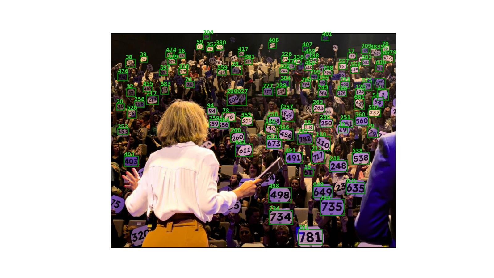

# About This Project

This project is an attempt to resolve a problem occuring during the charity event "La Nuit du Bien Commun".

The event usually takes place in theaters and selected associations are pitching to raise money. The public consists in potential donors, and each donor has a panel with a number written on it. After a pitch, the host ask the audience if they would like to donate: interested donors then raise their panels if they want to do so. The host then recites the number on every raised panels. In the meantime, there is someone backstage who actually writes down the numbers. The idea of this project is to develop an algorithm that automatically detects raised panels and their respective numbers.

Below is an illustration of the current status of the project

## Contributing

We welcome contributions from the community!

## License

This project is licensed under the MIT license. See the [LICENSE](guillaume-heusch/panel-detection/blob/main/LICENSE) file for more details.

## Contact

If you have any questions or feedback, please feel free to reach out via [GitHub](guillaume-heusch/panel-detection/issues).

