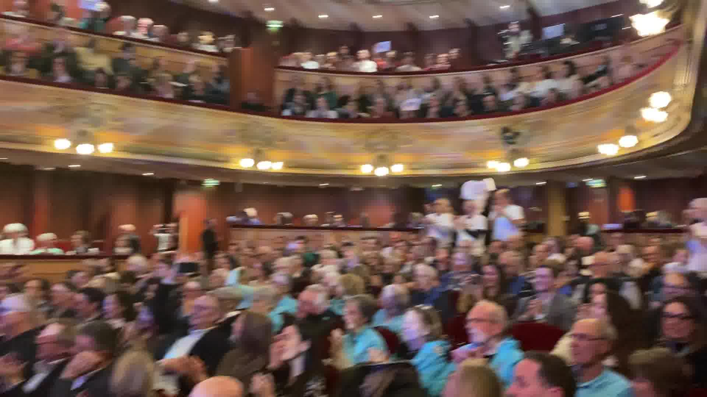
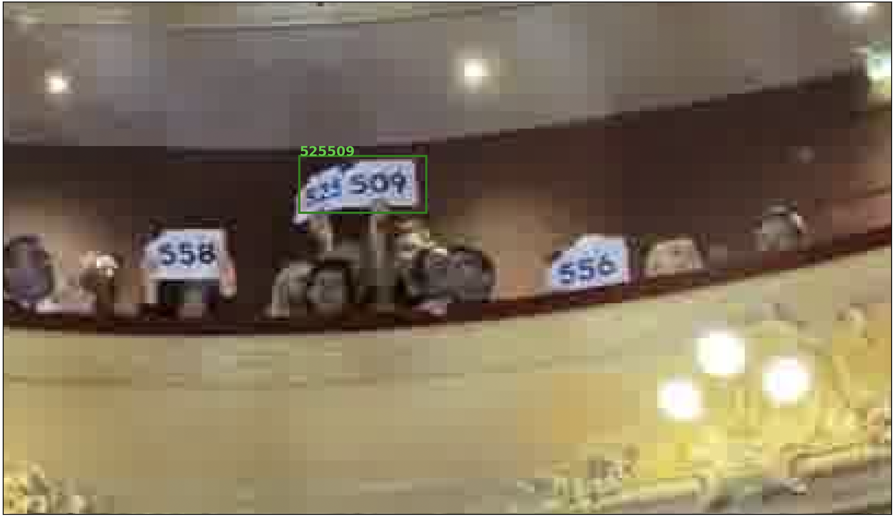
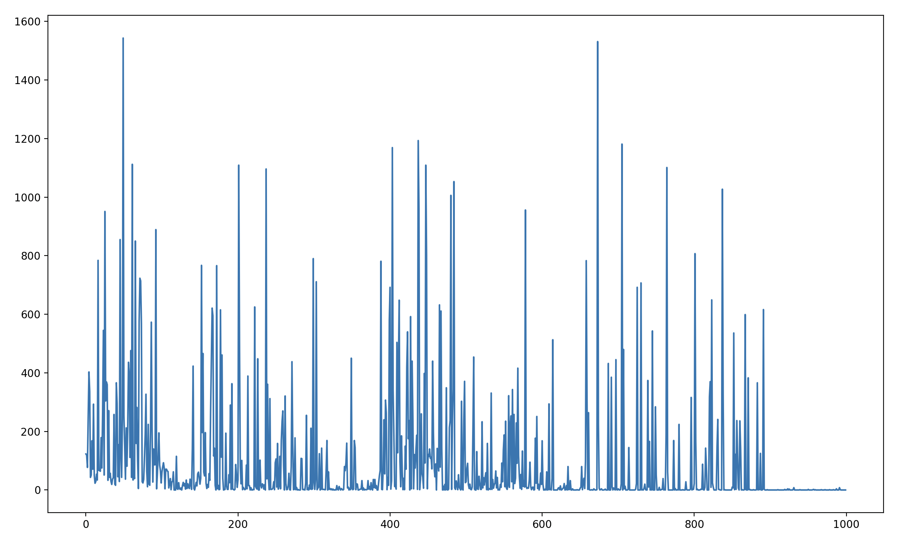

# THE DATA

**There are 29 video sequences**, but I don't know with which devices they have been captured. They all vary in length and overall quality I'd say. They are quite diverse, in the the sense that sometimes it's taken from the back of the venue, sometimes from the stage, and sometimes from the side. That makes a good set of different examples though.

## Extracting frames

Extracting individual frames from each sequence has been done with this simple ffmpeg command:

```shell
ffmpeg -i {video_file} {dir_with_frames}/{sequence_name}-frame%04d.png
```

**WARNING:** The `{dir_with_frames}` should exist before running the command.

**There is a grand total of 14932 frames**, with quite some redundancy (which is normal, since it's video sequences). I deliberately chose *not* to eliminate some, but I'm quite aware that this dataset is somehow not optimal because of that.

## Getting annotations

For each frame, an annotation file has been generated as a csv file. Each csv file contains one or several lines, i.e. one line for each detected panel. Here's an example of the content of such a csv file:

```
20,974,833,1075,899
861,2987,986,3143,1088
```

The first number is the detected number on the panel and the four remaining numbers are the coordinates of the bounding box as [xmin, ymin, xmax, ymax].

These detections have been automatically made using a [fine-tuned Faster R-CNN](https://docs.pytorch.org/tutorials/intermediate/torchvision_tutorial.html) for the bounding box detection and with the [OCR Tamil package](https://github.com/gnana70/tamil_ocr) for recognizing the numbers inside each panel.


### Unusable images

In some images, no panels can be detected. Consequently no csv file is generated for such images. This can happen for various reasons (an obvious one is that there is actually no panels in the image). Here's for instance an example of a blurry image where no panels are detected:

  

**Of the 14932 images in total, there are 1579 in which no panels are detected. This leaves us with 13353 usable frames.**

### Final annotations

There are cases where detected numbers are wrong (i.e. the number is not correctly recognized and does not correspond to the one written on the panel). Such cases have been automatically detected in the generated annotation files and simply removed from the annotations.

In particular, lines of the csv file where:

* The "number" contains a character different than a numeric
* The number is higher than 1000 (this can happen when two panels are close and side-by-side) or lower than zero.


have been removed from the annotation file. They have not been corrected, since this would have required way too much effort (visual validation). 

Here's an example of a faulty detection where two panels are side-by-side:

  

Note that this may cause issues for future evaluations, since the ground truth is *de facto* not exact. For instance, the case shown above has not been corrected into two panels. 

### Final dataset

As of now, the dataset contains 13353 frames. After the (rough) validation of the automatically generated annotations, we have 11111 remaining annotation files. This means that another 2242 frames are discarded. 

**In this final dataset, we hence have 11111 frames and a total of 95374 annotated panels**. The distribution of numbers in panels is shown in the picture below. 

  

The 3 most represented numbers are 49, 673 and 437 - this does not matters much, but why not havin this stat ? 

Regarding panels themselves, here are some statistics:

*  the smallest one has an area of (13, 13) = 169
*  the larger one is (975, 784) = 764400
*  the mean area is 9333 pixels squared. 

 

